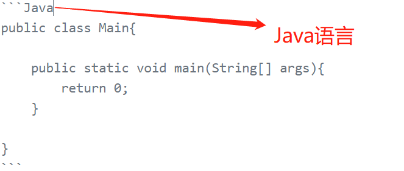

# MarkDown 
>Markdown是一种轻量级且易于使用的语法，用于在GitHub平台上设置所有形式的书写样式。
## 一、我们可以学到什么呢？
* Markdown格式如何使样式化协作编辑变得容易
* Markdown与传统的格式化方法有何不同
* 如何使用Markdown来格式化文本
* 如何利用GitHub的自动Markdown渲染
* 如何应用GitHub独特的Markdown扩展
## 二、什么是MarkDown呢？
>Markdown是在web上设计文本样式的一种方法，用来控制文档的显示;我们可以使用Markdown将文字格式化为粗体或斜体，添加图像和创建列表。大多数情况下，Markdown只是带有一些非字母字符的常规文本，比如`#`或`*`。
## 三、语法指南  
### 1. 标题  
>想要把一个文本变成标题，需要在该文本前面加上`#`号，一个代表1级标题，两个代表2级标题，以此类推，最多为6级，（ps：`#`必须放在新的一行的开始，即第一个字符）。
```markdown
	#		一级标题
	##		二级标题
	###		三级标题
	...
	######          六级标题
```  
### 2. 强调
>强调会将你想要强调的文本变得与普通文本不一样，在MarkDown语法规则中，有两种强调类型（倾斜和加粗），每种强调类型又有两种不同的表现形式（`*`和`_`）。其中强调的时候强调字符必须紧挨着第一个字符和最后一个字符，紧挨着强调字符的字符不能是空格（如果是有`*`后是空格就成了列表了）。
```markdown
	This text will be italic	正常文字
	*This text will be italic*	效果为倾斜
	_This will also be italic_	效果为倾斜

	**This text will be bold**	效果为加粗
	__This will also be bold__	效果为加粗

	_You **can** combine them_	双重叠加
```
### 3. 列表
>列表的重要性就不必多说了把（ps：列表开始有几个空格都行的，不过同级之间要对齐）。
#### a. 无序列表
```markdown
* Item 1
* Item 2
  * Item 2a
  * Item 2b
```
效果如下：  
* Item 1
* Item 2
  * Item 2a
  * Item 2b
#### b. 有序列表
>有序列表这儿用数字开始，数字后面有没有`.`或者`、`都行，数字是乱序的也行，效果都是下面这样的效果（ps：数字和文字之间要有一个间隔）。
```markdown
2. Item 1
3. Item 2
2. Item 3
   1. Item 3a
   1. Item 3b
```
效果如下：  
1. Item 1
1. Item 2
1. Item 3
   1. Item 3a
   1. Item 3b
### 4. 图片
>显示图片语法格式为``  
```markdown
	//访问本地图片，相对于当前项目的地址，这个是表示本目录下
	//访问本地图片，当前项目的路径
  //访问互联网上的其他图片
```
### 5. 链接
>语法格式为`[任意文字](herf)`
```markdown
百度了解一下->[百度](https://www.baidu.com)
```
### 6. 引用
>使用一个`>`符号就好，例子如下
```markdown
>巫师3了解一下啦（ps:真的很棒的游戏）
```
### 7. 内联代码
>语法格式为
```markdown
`任意文字`
```
> 
效果如下：  
`巫师3` `角色扮演` `剧情`
## 四、GitHub额外的有用功能
>GitHub.com使用自己版本的Markdown语法，该语法提供了一组额外的有用功能，其中许多功能可以更轻松地使用GitHub.com上的内容。
### 1. 代码高亮
```markdown
`字符重复3次，表示开始和结束，该三个字符必须是该行的前三个字符，开始的3个字符后接代码的语言，效果如下： 
```
### 2. 复选框

>`- [x] `表示一个已经被勾选的复选框，而`- [ ] `表示一个没有被勾选的复选框（ps：注意这中间的空格也不能省略），例子如下：  
- [x] 巫师三好玩吗？
- [x] Dota2好玩吗？
- [ ] LOL好玩吗？
### 3. 表格
>用连字符`-`（对于第一行）分隔，然后使用管道分隔每个列来创建表`|`，形式如下：
> 
预测算法 | 实际为阳性 | 实际为阴性
------- | ------------ | ------------- 
预测为阳性 | 真阳性 | 假阳性 
预测为阴性 | 假阴性 | 真阴性 
### 4. @他人
>键入`@`符号，后跟用户名，将通知该人来查看评论。这被称为“mention”，因为你提到的是个人。您也可以在组织内@团队。
> 
### 5. 自动链接网址
>任何URL（如 http://www.github.com ）都将自动转换为可点击的链接。
### 6. 删除线
>用两个波浪线（如`~~要删除的文字~~`）包裹的任何单词都会显示为划掉。
